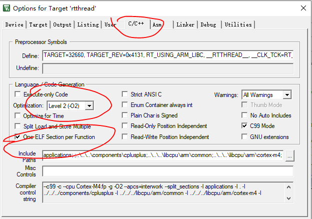

# RTTHREAD U8G2使用手册

## 简介

本文基于MAX32660 如何快速使用u8g2 软件包驱动oled屏幕

u8g2的原始github库在这里（感兴趣的可以研究一下）

https://github.com/olikraus/u8g2

## 启动步骤

第一步打开目录
https://github.com/RT-Thread/rt-thread/tree/master/bsp/maxim/MAX32660_EVSYS


bsp\maxim\MAX32660_EVSYS


右击menuconfig 具体步骤见如下图


第一步 menuconfig

在menuconfig里面选择如下选项：

- RT-Thread Components → Device virtual file system-> virtual system

- RT-Thread Components → POSIX layer and C standard library -> Enable libc APIs from toolchain
- RT-Thread online packages → peripheral libraries and drivers->u8g2
- peripheral libraries and drivers → U8G2: a monochrome graphic library → U8G2 Examples-> SPI (software)
- full buffer examples -> Hello world

这里面空格键是选中，下面select左右键选择，上下键选择菜单

第二步，输入命令：

```
scons --target=mdk5
```

第三步，打开keilproject 工程：

```

```

修改编译选项：




然后在HelloWorld.cpp里面找到对应的引脚连上就好了，把SPI几个脚和oled的几个脚连上即可。

代码如下：

```
static U8X8_SSD1306_128X64_NONAME_4W_SW_SPI u8x8( /* clock=*/ 2, /* data=*/ 3, /* cs=*/ 10, /* dc=*/ 11, /* reset=*/ 4);
```

你这边SPI连的哪个脚就用哪个脚。

然后就可以看到屏幕已经亮起来了
