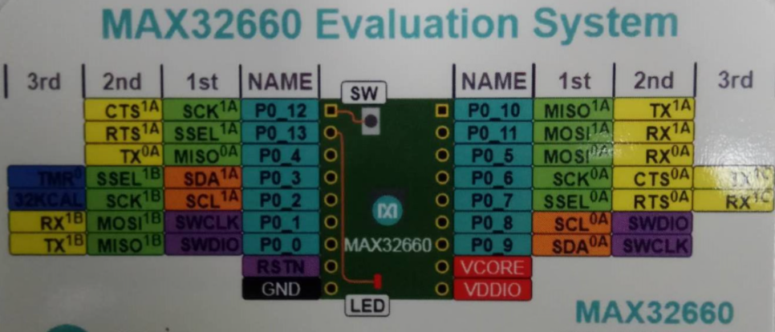

# BSP_BOARD_MAX32660

## IDE

- eclipse :  Windows: [ARMCortexToolchain.exe](04_tools\ARMCortexToolchain.exe)    Mac:  [ARMCortexToolchain.dmg](04_tools\ARMCortexToolchain.dmg) 

​       使用教程：  [eclipse.pdf](04_tools\eclipse.pdf) 

- keil:  [Maxim.MAX32660.1.2.0.pack](04_tools\Maxim.MAX32660.1.2.0.pack) 
- IAR

## 芯片相关

官方页面： [MAX32660](https://www.maximintegrated.com/en/products/microcontrollers/MAX32660.html)

参考手册： [Reference mannule.pdf](01_Reference_Mannel\Reference mannule.pdf)  

datasheet：  [MAX32660_datasheet.pdf](02_datasheet\MAX32660_datasheet.pdf) 

App Note: 

-  [ug7233 Secure BootloaderIn -Application Programming with Python® User Guide.pdf](06_application_note\ug7233 Secure BootloaderIn -Application Programming with Python® User Guide.pdf) 
-  [ug7159-max32660-bootloader-code-inapplication-programming-p2.pdf](06_application_note\ug7159-max32660-bootloader-code-inapplication-programming-p2.pdf) 

## 开发板相关

官方页面： [MAX32660-EVSYS](https://www.maximintegrated.com/en/products/microcontrollers/MAX32660-EVSYS.html)

原理图和User guide：  [MAX32660-EVSYS.pdf](03_schematic\MAX32660-EVSYS.pdf) 

## 视频教程

### 中文

- [32位MCU MAX32660开发板开箱评测](https://www.bilibili.com/video/BV1Pf4y1q7xD?from=search&seid=15645223761034308368)

- [FUNPACK 玩转超低功耗还带浮点运算的开发板](https://www.bilibili.com/video/BV1CT4y1P7MQ?from=search&seid=10145633555880620881)

### 英文

- [Build Smarter Devices with the World’s Smallest Arm® Cortex®-M4 with FPU Microcontroller](https://www.youtube.com/watch?v=2f_olKfvky4)
- [ARM Cortex-M4 max32660（芯片）处理器新手必看 英文](https://www.bilibili.com/video/BV1GK4y147Bz?from=search&seid=15645223761034308368)

## 参考文章

### 如何安装eclipse和使用

[【MAX32660试用体验】入门教程](https://bbs.elecfans.com/jishu_1746603_1_1.html)

### 比较详细的参考页面

电子森林

[MAX32660 - 超低功耗、高成效、高度集成微控制器](https://www.eetree.cn/doc/detail/2203)

[Funpack第六期活动板卡：MAX32660-EVSYS ](https://www.eetree.cn/doc/detail/2204)

### eclipse安装教程

[玩转超低功耗还带浮点运算的开发板=300元京东券——Digi-Key Funpack一起玩第六期来了](https://mp.weixin.qq.com/s/xunblhei3yEQo2Hp6tFewA)

### MAX32660试用体验

[电子发烧友](https://s.elecfans.com/s?type=1&keyword=MAX32660)

## 芯片开发参考手册摘要

### 芯片内部结构

### GPIO引脚功能图

